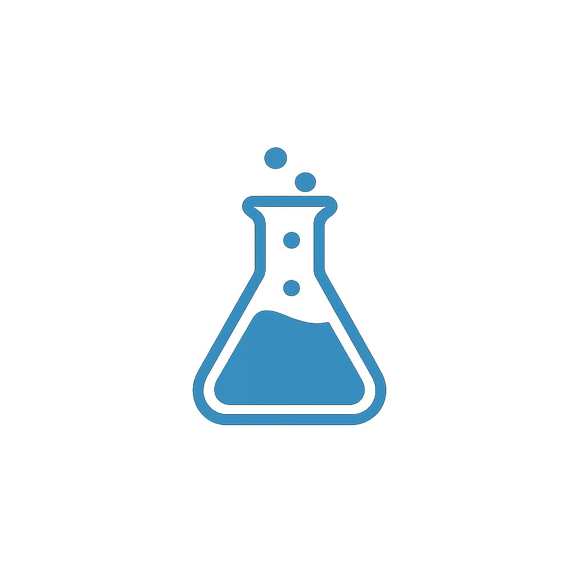

# 📊 Edith - Advanced Research Platform

<div align="center">




**Professional research survey platform with advanced statistical analysis**

[](https://typescriptlang.org/)
[](https://reactjs.org/)
[](https://nodejs.org/)
[](https://electronjs.org/)
[](https://mui.com/)

[ Features](#-features)  [ Quick Start](#-quick-start)  [ Documentation](#-api-documentation)  [ Tech Stack](#-technology-stack)

</div>

---

##  About Edith

**Edith** is a comprehensive research platform designed for academics, market researchers, and data analysts who need powerful tools for creating, conducting, and analyzing surveys and studies. Built with modern web technologies, Edith provides both web and desktop applications with advanced statistical analysis capabilities.

###  What makes Edith special?

- ** Intelligent Analytics**: Advanced statistical analysis including correlations, descriptive statistics, and trend analysis
- ** Professional Visualizations**: Interactive charts, graphs, and real-time data visualization
- ** Intuitive Design**: Clean, modern interface built with Material-UI components
- ** Real-time Updates**: Live data collection and instant statistical updates
- ** Data Security**: Local SQLite database ensures your research data stays private
- ** Cross-platform**: Available as web application and native desktop app (Windows, macOS, Linux)

---

##  Features

###  Research Management
- **Smart Survey Builder**: Drag-and-drop interface with 8+ question types
- **Advanced Logic**: Conditional questions, branching, and skip patterns
- **Template System**: Reusable research schemas and predefined templates
- **Study Lifecycle**: Draft  Active  Completed workflow with status management

###  Advanced Analytics
- **Descriptive Statistics**: Mean, median, mode, standard deviation, quartiles
- **Correlation Analysis**: Pearson, Spearman, and Kendall correlation coefficients
- **Text Analytics**: Sentiment analysis, word frequency, readability scores
- **Time Series Analysis**: Response trends over time with hourly/daily breakdowns
- **Outlier Detection**: Automatic identification of statistical outliers

###  Data Visualization
- **Interactive Charts**: Bar charts, pie charts, line graphs, scatter plots
- **Response Heatmaps**: Visual representation of response patterns
- **Real-time Dashboards**: Live updating statistics and metrics
- **Export Options**: PDF reports, Excel spreadsheets, CSV data export

###  Question Types
| Type | Description | Use Case |
|------|-------------|----------|
|  **Text** | Short text responses | Names, comments |
|  **Long Text** | Extended text areas | Essays, feedback |
|  **Number** | Numeric input with validation | Age, quantity |
|  **Scale** | Likert scales (1-5, 1-7, 1-10) | Satisfaction, agreement |
|  **Single Choice** | Radio button selection | Gender, preferences |
|  **Multiple Choice** | Checkbox selections | Skills, interests |
|  **Date** | Date picker with validation | Birth date, events |
|  **Email** | Email validation | Contact information |

---

##  Quick Start

### Prerequisites
```bash
Node.js >= 18.0.0
npm >= 8.0.0
Git
```

###  Installation

1. **Clone the repository**
```bash
git clone https://github.com/Shacloww/edith.git
cd edith
```

2. **Install dependencies**
```bash
# Install all dependencies for workspace
npm run install:all

# Or install individually
npm install          # Root workspace
cd backend && npm install   # Backend dependencies
cd ../frontend && npm install  # Frontend dependencies
```

3. **Database setup**
```bash
cd backend

# Generate Prisma client
npx prisma generate

# Create and migrate database
npx prisma db push

# (Optional) Open Prisma Studio for database inspection
npx prisma studio
```

4. **Start development servers**
```bash
# Option 1: Start both backend and frontend simultaneously
npm run dev

# Option 2: Start separately
# Terminal 1 - Backend (http://localhost:5000)
cd backend && npm run dev

# Terminal 2 - Frontend (http://localhost:3000)
cd frontend && npm run dev

# Option 3: Desktop application
cd frontend && npm run electron-dev
```

###  Building for Production

```bash
# Build backend
cd backend
npm run build
npm start

# Build frontend
cd frontend
npm run build

# Build desktop application
npm run electron-build

# Create distribution packages
npm run dist-win     # Windows installer
npm run dist-mac     # macOS app
npm run dist-linux   # Linux package
```

---

##  Architecture

Edith follows a modern full-stack architecture with clear separation of concerns:

###  Project Structure

```
edith/
  backend/                    # Node.js API Server
     src/
        controllers/        # Business logic
         routes/            # API endpoints
        middleware/         # Express middleware
        data/               # Sample data & seeds
         types/             # TypeScript definitions
        server.ts           # Express application
      prisma/               # Database configuration
        schema.prisma       # Database schema
        dev.db              # SQLite database
     package.json
   frontend/                 # React Application
      src/
        components/         # Reusable UI components
        pages/              # Application pages
           StudyStatistics/ # Advanced analytics module
              components/ # Statistics UI components
              hooks/      # Custom React hooks
               utils/      # Statistical calculations
               types.ts   # Statistics type definitions
          ... (other pages)
        services/           # API communication
         types/             # TypeScript definitions
        App.tsx             # Main application
     public/
        electron.js         # Electron main process
         assets/            # Static assets
     package.json
  shared/                     # Shared utilities
  package.json                # Workspace configuration
```

---

##  Technology Stack

###  Backend Technologies

| Technology | Version | Purpose |
|------------|---------|---------|
| **Node.js** | ^18.0.0 | JavaScript runtime |
| **Express.js** | ^4.18.0 | Web application framework |
| **TypeScript** | ^5.0.0 | Type-safe JavaScript |
| **Prisma** | ^5.0.0 | Next-generation ORM |
| **SQLite** | ^3.0.0 | Embedded database |
| **Express Validator** | ^7.0.0 | Input validation middleware |
| **CORS** | ^2.8.0 | Cross-origin resource sharing |
| **Helmet** | ^7.0.0 | Security middleware |

###  Frontend Technologies

| Technology | Version | Purpose |
|------------|---------|---------|
| **React** | ^18.2.0 | UI library |
| **TypeScript** | ^5.0.0 | Type-safe JavaScript |
| **Material-UI** | ^5.14.0 | React component library |
| **React Router** | ^6.8.0 | Client-side routing |
| **React Hook Form** | ^7.45.0 | Form validation & management |
| **Axios** | ^1.4.0 | HTTP client |
| **React Hot Toast** | ^2.4.0 | Toast notifications |
| **Recharts** | ^2.8.0 | Chart library |

###  Desktop Technologies

| Technology | Version | Purpose |
|------------|---------|---------|
| **Electron** | ^25.0.0 | Cross-platform desktop apps |
| **Electron Builder** | ^24.0.0 | Application packaging |
| **Electron Updater** | ^6.1.0 | Auto-update functionality |

###  Statistical Computing

| Library | Purpose |
|---------|---------|
| **Custom Statistics Engine** | Descriptive statistics, correlations |
| **Text Analysis Module** | Sentiment analysis, word frequency |
| **Time Series Analysis** | Trend detection, seasonal patterns |
| **Data Visualization** | Interactive charts and graphs |

---

##  API Documentation

###  Research Schemas API

| Method | Endpoint | Description |
|--------|----------|-------------|
| `GET` | `/api/research-schemas` | List all research schemas |
| `GET` | `/api/research-schemas/:id` | Get schema details |
| `POST` | `/api/research-schemas` | Create new schema |
| `PUT` | `/api/research-schemas/:id` | Update schema |
| `DELETE` | `/api/research-schemas/:id` | Delete schema |

###  Studies API

| Method | Endpoint | Description |
|--------|----------|-------------|
| `GET` | `/api/studies` | List all studies |
| `GET` | `/api/studies/:id` | Get study details |
| `POST` | `/api/studies` | Create new study |
| `PUT` | `/api/studies/:id` | Update study |
| `PATCH` | `/api/studies/:id/status` | Update study status |
| `DELETE` | `/api/studies/:id` | Delete study |

###  Responses & Analytics API

| Method | Endpoint | Description |
|--------|----------|-------------|
| `GET` | `/api/responses/study/:studyId` | Get study responses |
| `GET` | `/api/responses/:id` | Get response details |
| `POST` | `/api/responses` | Submit new response |
| `DELETE` | `/api/responses/:id` | Delete response |
| `GET` | `/api/responses/study/:studyId/statistics` | Get statistical analysis |

---

##  Statistical Features

###  Descriptive Statistics
- **Central Tendency**: Mean, median, mode
- **Variability**: Standard deviation, variance, range, IQR
- **Distribution**: Frequency tables, percentiles, quartiles
- **Outlier Detection**: IQR method, z-score analysis

###  Correlation Analysis
- **Pearson Correlation**: Linear relationships between variables
- **Spearman Correlation**: Monotonic relationships (rank-based)
- **Kendall's Tau**: Non-parametric correlation measure
- **Cramér's V**: Association between categorical variables

###  Text Analytics
- **Sentiment Analysis**: Positive, negative, neutral classification
- **Word Frequency**: Most common words and phrases
- **Readability Scores**: Text complexity analysis
- **Content Analysis**: Keyword extraction and themes

###  Time Series Analysis
- **Trend Detection**: Response patterns over time
- **Seasonal Patterns**: Daily and hourly response cycles
- **Response Velocity**: Real-time collection monitoring
- **Completion Rates**: Temporal completion analysis

---

##  Development

###  Development Setup

```bash
# Install development dependencies
npm run install:dev

# Run development servers with hot reload
npm run dev:watch

# Run tests
npm run test:all

# Run linting
npm run lint:all

# Run type checking
npm run type-check
```

###  Testing

```bash
# Backend tests
cd backend
npm run test
npm run test:watch
npm run test:coverage

# Frontend tests
cd frontend
npm run test
npm run test:watch
npm run test:coverage
```

###  Code Quality

```bash
# ESLint
npm run lint

# Prettier
npm run format

# TypeScript checking
npm run type-check

# Pre-commit hooks
npm run pre-commit
```

---

##  Contributing

We welcome contributions! Please see our [Contributing Guide](CONTRIBUTING.md) for details.

###  Development Workflow

1. **Fork** the repository
2. **Create** your feature branch (`git checkout -b feature/amazing-feature`)
3. **Commit** your changes (`git commit -m 'Add amazing feature'`)
4. **Push** to the branch (`git push origin feature/amazing-feature`)
5. **Open** a Pull Request

###  Bug Reports

Please use the [issue tracker](https://github.com/Shacloww/edith/issues) to report bugs.

---

## 📄 License

This project is protected by **Copyright**. All rights reserved.

**© 2025 Edith Research Platform. All rights reserved.**

This software and its documentation are proprietary and confidential. Unauthorized copying, distribution, or modification is strictly prohibited.

---

##  Links

- **Repository**: [https://github.com/realshaclow/edith](https://github.com/realshaclow/edith)
- **Documentation**: [Coming Soon]
- **Issues**: [https://github.com/realshaclow/edith/issues](https://github.com/realshaclow/edith/issues)

---

<div align="center">

**Built with  for the research community**

 Star this repository if you find it helpful!

</div>
